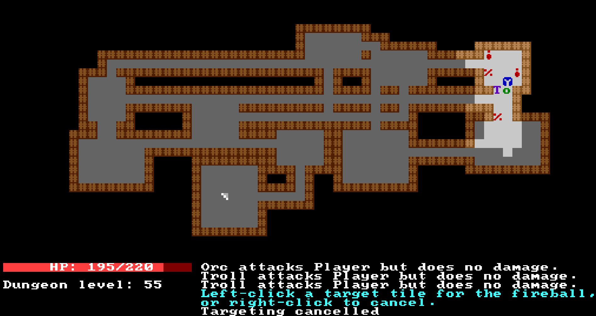

# Overview

ATRL (A Tiny RogueLike) is a tiny roguelike written in Python using libtcod.

# Usage

You need Python and the libtcod library. The game is started using the following
command:

    $ python main.py

Your goal is to go to dungeon floor 8, find the famous "Amulet of Oderny" and
return it to the surface.

# License

MIT (code), CC0 (tiles)

